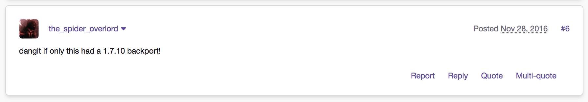
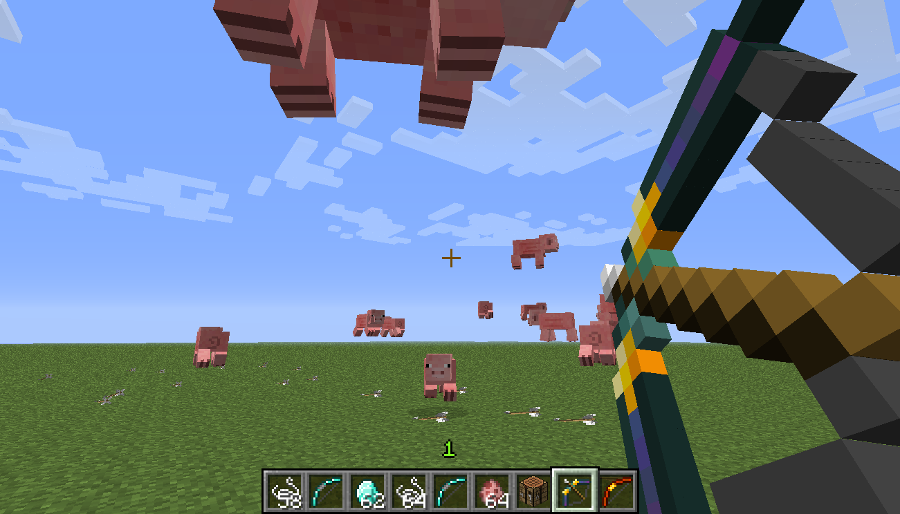

# More Bows for <s>1.7.10</s> 1.16.4 (very WIP)!

**_The 1.16.4 port is VERY in alpha! I'll write more once it's progressed further... In the meantime, please check out the 1.7.10 port! Original 1.7.10 description:_**

  

This is a port of the More Bows mod to 1.7.10! This mod was originally created by GaussFire, and then maintained & updated by iDiamondhunter. This port aims to faithfully re-create the original mod, while fixing some bugs & potentially introducing new mechanics (or re-adding cut ideas!).

### Original descriptions of each bow (not currently 100% accurate!):

- Reinforced Bow : This bow is just like the regular wooden bow, but has more durability.
- Iron Bow : This bow is a step up from the reinforced bow, having slightly more damage and durability, along with a minuscule upgrade of draw speed.
- Golden Bow : The bow forged of gold: it has a pathetic amount of uses but overall does the most damage. Quick reflexes allow you to shoot at double the speed!
- Crystal Bow : A bow sealed with the power of diamond, not many can survive it's swift and damaging moves. With a diamond base, you don't need to worry about over-pulling, this bow also doubles your draw speed!
- Blazing Bow : A bow from the horrible pits of the Nether, the power of fire emanates from the weapon in your hand. With this bow, you can do double the damage of a normal bow, while setting your foes alight!
- Ender Bow : A mysterious bow with the secrets of the Ender within. Along with having a slow drawback, it will use the Ender's technique to shoot a regular arrow that will not damage anything but, after 3 seconds, will summon 5 more arrows to kill it's opponents.
- Legia Bow : The final and most overwhelming bow, it delivers fast and many blows to its enemies. Even with two arrows, your draw speed will be faster than the iron bow!
- Frost Bow : Bonus bow for Christmas! Present for everyone who was supporting iDiamondhunter with the mod! This bow makes entities go slowly but its draw speed is awful. It also creates a snow layer on impact, and freezes water!

Descriptions taken from [iDiamondhunter's page for the mod](https://www.minecraftforum.net/forums/mapping-and-modding-java-edition/minecraft-mods/1286765-1-6-2-more-bows-mod).

### Other people's ports:
- LucidSage's port of the More Bows mod to 1.8 can be found [here](https://github.com/LucidSage/More-bows)!

### Licence:
As iDiamondhunter ["removed the copyrights" from this mod](https://www.minecraftforum.net/forums/mapping-and-modding-java-edition/minecraft-mods/1286765-1-6-2-more-bows-mod?comment=733), I presume that this mod is free of any known copyright, and that it is in the public domain. Therefore, I will be keeping it licensed as such.

  

  

